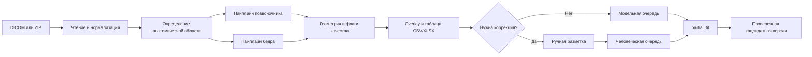

# DXA Studio

DXA Studio — исследовательская система контроля качества DXA-снимков поясничного отдела позвоночника и проксимального отдела бедренной кости. Она принимает DICOM, запускает модель, показывает разметку и найденные нарушения, формирует таблицу результата и позволяет специалисту исправить разметку перед дообучением.

> Проект не ставит диагноз и не заменяет решение врача. Он проверяет качество изображения и корректность укладки. Флаги в результате — индикаторы ошибок снимка, а не состояния пациента.

## Что умеет система

- загружать один DICOM, набор DICOM или ZIP-архив;
- обрабатывать снимки пакетом и показывать ход обработки по файлам;
- определять область: позвоночник, левое или правое бедро;
- отображать настоящую модельную разметку и список найденных ошибок;
- открывать несколько независимых исследований рядом для сравнения;
- выгружать результат в CSV или XLSX;
- исправлять линии, точки, контуры и флаги в интерфейсе;
- хранить модельную и человеческую разметку раздельно;
- запускать `partial_fit` минимум с одним исправленным человеком снимком.

## Какие нарушения проверяются

### Поясничный отдел позвоночника

1. **Корректность укладки**
   - видимость Th12;
   - видимость подвздошных костей.
2. **Наклон позвоночника**
   - углы между соседними позвонками;
   - общий угол от L5 до Th12;
   - разделение сколиоза и превышения допустимого общего отклонения.
3. **Артефакты**
   - посторонние предметы и другие помехи на снимке.

### Тазобедренный сустав и проксимальный отдел бедренной кости

1. **Корректность ROI**
   - определение большого вертела, шейки и седалищной кости;
   - построение ROI по костным ориентирам;
   - проверка расстояний от ROI до краёв снимка.
2. **Ротация и отклонение кости**
   - площадь видимой области малого вертела;
   - угол кости относительно вертикали изображения.
3. **Артефакты и импланты**

Проверки выполняются независимо, поэтому один снимок может содержать несколько нарушений. В вывод попадают все обнаруженные проблемы. Если одно нарушение не позволяет оценить другое, для зависимой проверки возвращается статус **«не удалось оценить»**, а не ложный результат «норма».

## Модель и обработка снимка

1. **Предобработка.** `pydicom` декодирует однокадровый двумерный DICOM. Применяются Modality LUT и, если доступно, VOI LUT; яркость ограничивается перцентилями 0,5–99,5 и приводится к диапазону 0–1. `MONOCHROME1` инвертируется. Для пространственных моделей сохраняется соотношение сторон с padding, затем изображение нормализуется как вход ImageNet. Правое бедро отражается только внутри ветви бедра.
2. **Определение области.** Маршрутизатор на ResNet18 выбирает позвоночник, левое или правое бедро.
3. **Позвоночник.** ResNet18 с U-Net-декодером строит межпозвоночные линии и подвздошные ориентиры; отдельная модель оценивает сколиоз. Артефакты ищет Faster R-CNN MobileNetV3 FPN.
4. **Бедро.** ResNet18 с U-Net-декодером предсказывает три анатомические точки, маску малого вертела и границы ROI.
5. **Постобработка.** Координаты возвращаются в исходный размер DICOM. Геометрические правила рассчитывают углы, видимость, ROI и ротацию, после чего формируются флаги качества, overlay и таблица. Недоступная проверка получает `null` и статус «не удалось оценить».

Итоговые веса обучены командой и передаются отдельным model bundle. Архитектуры и начальные ImageNet-веса берутся из `torchvision`; происхождение и ограничения описаны в [`MODEL_CARD.md`](MODEL_CARD.md).

## Как всё связано



Новая версия модели после дообучения не активируется автоматически. Сначала она проходит проверку, затем может быть активирована отдельной командой API.

## Структура проекта

| Каталог | Назначение |
|---|---|
| `user_web_prototype/` | Основной пользовательский веб: загрузка, просмотр, экспорт, исправление разметки и запуск дообучения. |
| `dxa_project/service/` | FastAPI-сервис модели, фоновые задания, экспорт, логи и `partial_fit`. |
| `dxa_project/geometry_ml/` | Модели и правила для маршрутизации, позвоночника, бедра и артефактов. |
| `dxa_project/augmentation/` | Преобразования снимков и геометрии для дообучения. |
| `labeler/` | Отдельный интерфейс первичной ручной разметки датасета. |
| `dxa_project/tests/` | Контрактные и модульные тесты API, геометрии и метрик. |

## Системные требования и зависимости

- Linux x86-64 или Windows с Docker Desktop и Linux containers;
- Docker Compose v2;
- современный Chrome или Chromium;
- CPU-режим обязателен и включается через `DXA_DEVICE=cpu`; NVIDIA GPU с совместимым Docker runtime опционален;
- доступ в интернет нужен только при первой сборке контейнеров;
- свободное место зависит от model bundle, DICOM и локальной очереди; медицинские данные в Git не входят.

Контейнер API использует Python 3.13, веб и разметчик — Python 3.11. Прямые Python-зависимости зафиксированы в:

- [`dxa_project/requirements-geometry.txt`](dxa_project/requirements-geometry.txt);
- [`dxa_project/service/requirements.txt`](dxa_project/service/requirements.txt);
- [`user_web_prototype/requirements.txt`](user_web_prototype/requirements.txt);
- [`labeler/requirements.txt`](labeler/requirements.txt).

Сведения о лицензиях зависимостей и источнике базовых моделей находятся в [`THIRD_PARTY_NOTICES.md`](THIRD_PARTY_NOTICES.md). Проектная лицензия отдельно не выбрана: публичная доступность репозитория сама по себе не даёт дополнительных прав на код или веса.

## Быстрый запуск пользовательского веба

### 1. Что потребуется

- Docker Desktop с Linux containers;
- архив модели `backend_models_20260929.zip`.

GPU необязателен. Для принудительного CPU-режима скопируйте пример настроек:

```powershell
Copy-Item user_web_prototype\.env.example user_web_prototype\.env
```

и установите в `.env` `DXA_DEVICE=cpu`. Значение `auto` использует CUDA при её наличии и иначе переключается на CPU.

Распакуйте архив модели в корень проекта с сохранением структуры:

```text
dxa_project/outputs/final_20260929/
  protocol.json
  bundle/
    router.pt
    spine.pt
    spine_crests.pt
    scoliosis.pt
    hip.pt
    hip_mask.pt
    hip_points.pt
    artifact.pt
    training_config.json
    landmark_geometry_bounds.json
    model_manifest.json
    protocol.json
    evaluation/calibration.json
```

### 2. Запуск

```powershell
cd user_web_prototype
docker compose up -d --build
```

Откройте:

- пользовательский веб — <http://localhost:8503>;
- Swagger API — <http://localhost:8765/docs>.

Проверка состояния API: `GET http://localhost:8765/v1/health`. В готовом состоянии ответ содержит `status=ready` и непустую активную версию модели.

Подробная подготовка backend описана в [`dxa_project/service/BACKEND_SETUP_CHECKLIST.md`](dxa_project/service/BACKEND_SETUP_CHECKLIST.md), полный контракт — в [`dxa_project/service/API_GUIDE.md`](dxa_project/service/API_GUIDE.md).

### Развёртывание

Compose поднимает два контейнера: `dxa-api` на порту `8765` и `dxa-user-web` на `8503`. Настройки портов и устройства находятся в `user_web_prototype/.env`:

```dotenv
DXA_API_PORT=8765
DXA_USER_WEB_PORT=8503
DXA_DEVICE=auto
```

Пользовательские загрузки и очередь сохраняются в `user_web_prototype/prototype_data/`, хранилище API — в `dxa_project/service_data/`. Эти каталоги локальные и исключены из Git. Для серверного развёртывания ограничьте доступ к портам, разместите приложение за HTTPS reverse proxy и храните DICOM только в защищённом томе.

### Реализованный API

| Метод и путь | Назначение |
|---|---|
| `GET /v1/health` | состояние сервиса и активная версия модели; |
| `POST /v1/data/uploads` | загрузка одного DICOM в хранилище API; |
| `POST /v1/model/predict` | запуск обработки одного файла или пакета; |
| `GET /v1/jobs/{id}` | статус, прогресс и результат задания; |
| `GET /v1/jobs/{id}/logs` | пофайловые события инференса или эпохи дообучения; |
| `GET /v1/jobs/{id}/export` | JSON, CSV или ZIP с результатом; |
| `GET /v1/results/{id}` | геометрия, флаги, оценки и ссылки на артефакты; |
| `PUT /v1/data/images/{id}/annotation` | сохранение исправленной человеком разметки; |
| `POST /v1/model/partial_fit` | запуск дообучения с обязательным `human` и необязательным `model`; |
| `POST /v1/model/versions/{version}/activate` | ручная активация проверенной версии. |

OpenAPI доступен в [`dxa_project/service/openapi.json`](dxa_project/service/openapi.json) и через Swagger на `/docs`.

### Проверка сборки

```powershell
docker compose -f user_web_prototype\docker-compose.yml config --quiet
python -m pip install -r dxa_project\requirements-geometry.txt -r dxa_project\service\requirements.txt
python -m pytest dxa_project\tests user_web_prototype\tests -q
```

После установки model bundle можно дополнительно выполнить CPU smoke test:

```powershell
python -m dxa_project.service.smoke
```

### Замена модели

При пустом хранилище новый bundle регистрируется автоматически из `dxa_project/outputs/final_20260929/bundle`. Для другой директории передайте `--bootstrap-bundle`. В уже работающем сервисе зарегистрируйте новый bundle через `POST /v1/model/versions`, проверьте его и только затем активируйте через `POST /v1/model/versions/{version}/activate`. Старые версии сохраняются для отката.

## Основной сценарий в вебе

1. Откройте DXA Studio и войдите локальным пользователем либо нажмите **«Зайти как гость»**. Гостю доступен полный рабочий сценарий.
2. Нажмите большую карточку **«Добавьте исследование»** и выберите DICOM или ZIP. Папку с DICOM можно перетащить на карточку.
3. Следите за именем текущего файла и полосой прогресса. После завершения интерфейс покажет число успешно обработанных снимков.
4. Переключайте снимки стрелками или выпадающим списком над изображением.
5. Для параллельного просмотра добавьте отдельное исследование либо откройте ещё один снимок из уже загруженного набора.
6. Скачайте таблицу в CSV или XLSX.
7. При необходимости откройте **«Изменить разметку»**, исправьте геометрию и флаги, затем нажмите **«Скорректировать модель»**.
8. После хотя бы одной ручной корректировки запустите дообучение. Статус доступен в разделе **«Задания дообучения»**.

Модельные предсказания автоматически попадают в скрытый набор `model` и не увеличивают счётчик интерфейса. Если пользователь исправил снимок, его модельная версия исключается, а исправленная версия попадает в обязательный набор `human`.

## Входные и выходные данные

**Вход:** один или несколько однокадровых двумерных DICOM (`.dcm`, `.dicom`) либо ZIP с такими файлами. PNG/JPEG не принимаются как вход модели. Максимум за одну загрузку — 1000 DICOM; один DICOM — до 128 МиБ; ZIP и его суммарное распакованное содержимое — до 512 МиБ. Небезопасные пути, символические ссылки и исполняемые файлы в ZIP отклоняются.

**Выход:** модельный overlay PNG, JSON с геометрией и флагами, таблица CSV/XLSX и ZIP-экспорт задания. Пример обезличенного ответа находится в [`dxa_project/service/examples/predict_result.json`](dxa_project/service/examples/predict_result.json).

CSV/XLSX содержит согласованные поля API:

| Поле | Значение |
|---|---|
| `path_to_study` | путь или имя исходного исследования; |
| `study_uid` | DICOM Study Instance UID; |
| `image_uid` | DICOM SOP Instance UID; |
| `anatomical_region` | позвоночник, левое или правое бедро; |
| `quality_class` | итоговый класс качества; |
| `violation_type` | одно или несколько нарушений; |
| `processing_status` | успешная обработка, ошибка или невозможность оценки; |
| `time_of_processing` | время обработки файла. |

Ошибка одного DICOM не останавливает весь пакет: файл получает собственный статус, а остальные продолжают обрабатываться.

## Известные ошибки и обработка

| Ситуация | Что делает система |
|---|---|
| Повреждённый ZIP, небезопасный путь, ссылка или исполняемый файл | отклоняет архив до сохранения снимков и показывает понятную ошибку; |
| Превышен лимит файла, архива или числа DICOM | прекращает загрузку превышающей части и сообщает действующий лимит; |
| В архиве нет DICOM | предлагает выбрать другой источник; |
| DICOM не двумерный или pixel data не декодируется | помечает файл ошибкой, остальные файлы пакета продолжает обрабатывать; |
| API недоступен или активная модель не зарегистрирована | возвращает статус недоступности и не запускает ложную обработку; |
| Часть флагов не может быть оценена | сохраняет `null` и «не удалось оценить», а не подменяет результат нормой; |
| Инференс одного файла завершился ошибкой | сохраняет `Failure` и причину, не останавливает весь пакет; |
| Дообучение запущено без ручной корректировки | интерфейс объясняет, что нужен минимум один элемент `human`; |
| Кандидатная версия не прошла проверку | не активирует её и сохраняет действующую версию модели. |

## Дообучение

Для обычного `predict` достаточно архива модели. Для настоящего `partial_fit` дополнительно нужен `backend_training_reference_20260929.zip` с фиксированной validation-выборкой и данными для проверки утечки.

Правила запуска:

- `human` обязан содержать хотя бы один новый снимок с подтверждённой или исправленной человеком разметкой;
- `model` необязателен и может быть пустым;
- один и тот же снимок не должен одновременно входить в `human` и `model`;
- validation/test-снимки и их пиксельные дубликаты запрещены для дообучения;
- человеческие метки не заменяются новым предсказанием модели;
- модельные и человеческие оригиналы и аугментации хранятся раздельно.

Краткая процедура дообучения:

1. распаковать reference-архив в корень проекта;
2. выполнить `predict` для новых DICOM;
3. открыть минимум один снимок, исправить разметку и сохранить его как `human`;
4. при желании оставить остальные неисправленные предсказания в наборе `model`;
5. нажать **«Запустить дообучение»** или вызвать `POST /v1/model/partial_fit`;
6. дождаться четырёх условных этапов: `human_original`, `model_original`, `human_augmented`, `model_augmented`; пустые модельные этапы пропускаются;
7. проверить validation-отчёт и вручную активировать только версию со статусом `validated`.

Полное обучение выполняется скриптом `python -m dxa_project.geometry_ml.train` после подготовки manifest и фиксированного train/validation/test split. Команды и параметры находятся в [`dxa_project/geometry_ml/README.md`](dxa_project/geometry_ml/README.md). Не используйте test для выбора порогов или версии модели.

## Отдельный интерфейс разметки

`labeler/` нужен для первичной разметки датасета и может запускаться независимо:

```powershell
cd labeler
Copy-Item .env.example .env
docker compose up -d --build
```

После запуска откройте <http://localhost:8501>. Пути к исходным DICOM, результатам и справочной таблице задаются в `.env`. Не удаляйте существующую папку с разметкой при обновлении проекта.

## Что закрывает MVP

| Требование промежуточной сдачи | Реализация в проекте |
|---|---|
| Обученная модель и инференс | Версионируемый model bundle и API `predict`. |
| Чтение DICOM и пакетная обработка | Один файл, набор файлов и ZIP; ошибка файла не останавливает пакет. |
| Бинарный итог «качественное / есть нарушение» | `quality_class` и детальные типы нарушений. |
| Проверка разметки анатомической области | Геометрия позвоночника и бедра, точки, линии, маски и артефакты. |
| Файл с результатами | CSV, XLSX и API-артефакты. |
| Метрики на validation | Тесты и модуль расчёта метрик; значения фиксируются для конкретной версии модели и набора данных. |
| Краткая инструкция | Этот README, гайд API и инструкция внутри веба. |
| Ограничения и план развития | Раздел ниже. |

## Соответствие требованиям к документации

| Требование | Где описано |
|---|---|
| Назначение, возможности и ограничения | начало README, «Что умеет система», «Ограничения»; |
| Структура проекта | «Структура проекта»; |
| Системные требования и зависимости | «Системные требования и зависимости» и файлы requirements; |
| Сборка и запуск контейнеров | «Быстрый запуск» и «Развёртывание»; |
| Реализованный API | таблица API, OpenAPI и `API_GUIDE.md`; |
| Форматы входных и выходных данных | «Входные и выходные данные» и обезличенный JSON-пример; |
| Модель, предобработка и постобработка | «Модель и обработка снимка» и `MODEL_CARD.md`; |
| Известные ошибки и их обработка | «Известные ошибки и обработка»; |
| Руководство пользователя | «Основной сценарий в вебе» и раздел «Помощь» приложения; |
| Руководство по развёртыванию | «Развёртывание» и `BACKEND_SETUP_CHECKLIST.md`; |
| Обучение и дообучение | «Дообучение» и `geometry_ml/README.md`. |

## Метрики качества

Метрики следует считать отдельно для каждой анатомической области и каждого нарушения, а также сводно:

- sensitivity для исследований с нарушениями;
- specificity для качественных исследований;
- balanced accuracy и F1;
- ROC AUC и/или PR AUC для бинарной классификации;
- macro-F1 для многоклассового или multilabel-вывода;
- Dice и IoU для масок;
- расстояние между предсказанными и эталонными ключевыми точками;
- время обработки одного исследования;
- доля успешно обработанных файлов.

Приоритетные клинические сводные метрики — **F1** и **ROC-AUC**. Для финального отчёта желательно приводить 95% доверительные интервалы. README намеренно не фиксирует числа: они должны быть рассчитаны для конкретного model bundle и неизменной validation-выборки.

## Что показать на демонстрации

- почему выбран текущий подход;
- архитектуру модели и программного решения;
- состав датасета, правила train/validation/test и предобработку;
- таксономию нарушений и обработку нескольких нарушений на одном снимке;
- результаты экспериментов, сравнение вариантов и анализ ошибок;
- метрики с доверительными интервалами;
- скорость обработки и системные требования;
- ограничения и предполагаемый сценарий внедрения;
- несколько сквозных кейсов от DICOM до таблицы и ручной коррекции.

## Ограничения

- поддерживаются однокадровые серые DICOM; PNG и JPEG не являются входным форматом модели;
- для Docker-запуска API в текущей конфигурации требуется совместимый NVIDIA GPU;
- model bundle и медицинские данные не хранятся в публичном Git-репозитории;
- `partial_fit` требует внешнего reference-архива и минимум одной человеческой корректировки;
- `quality_scores` — рабочие оценки пайплайна, а не диагностические вероятности;
- новая версия после дообучения требует проверки и ручной активации;
- качество необходимо подтверждать на независимой выборке, а не только на внутренней validation.

## Данные и безопасность

DICOM, разметка, веса, локальные базы, очереди, результаты экспериментов и архивы исключены из публичного репозитория. Храните их локально или в защищённом хранилище. Перед публикацией снимков дополнительно проверяйте DICOM-теги на персональные данные.

Контакт по работе с веб-интерфейсом: [Telegram @nsavkov](https://t.me/nsavkov).
